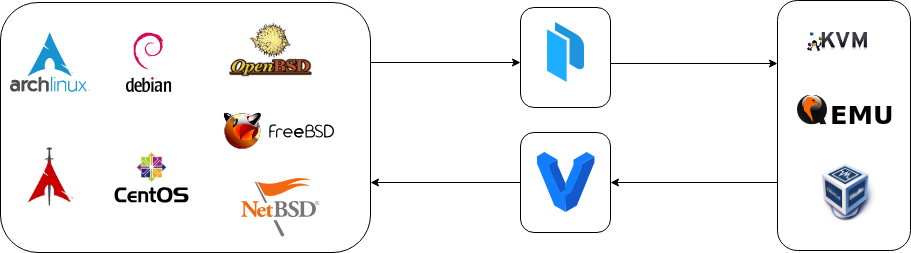

# Bento

* Master :
[](https://circleci.com/gh/nlamirault/bento/tree/master)

* Develop :
[](https://circleci.com/gh/nlamirault/bento/tree/develop)



Some [Vagrant][] boxes . See: https://atlas.hashicorp.com/nlamirault


## Usage

* Add a box :

        $ vagrant box add nlamirault/<box_name>


* The following boxes are built from this repository's templates :

| Name           | VirtualBox (5.x)    |
| -------------- | ------------------- |
| debian-8       | [amd64][D8]         |
| archlinux      | [amd64][Arch]       |
| centos-7.2     | [amd64][C72]        |
| freebsd-10.2   | [amd64][FBSD102]    |
| freebsd-10.3   | [amd64][FBSD103]    |
| openbsd-5.9    | [amd64][OBSD59]     |
| netbsd-7.0     | [amd64][NBSD70]     |


* Using a box in a Vagrantfile:

```ruby
VAGRANTFILE_API_VERSION = "2"

Vagrant.configure(VAGRANTFILE_API_VERSION) do |config|
  config.vm.box = "nlamirault/<box_name>"
  config.ssh.forward_agent = true
  config.vm.provider "virtualbox" do |v|
    v.memory = 1024
    v.gui = true
  end
end
```

## Build boxes

* Install [Packer][] (>= 0.8)

* Setup your Atlas token :

        $ export ATLAS_TOKEN="xxxxxxxxxxxx"

* Username : `vagrant`
* Password: `vagrant`

### Debian

    $ make virtualbox template=debian-8-amd64.json
    $ cd vagrant/debian
    $ vagrant up

### Archlinux

    $ make virtualbox template=archlinux.json
    $ cd vagrant/archlinux
    $ vagrant up

### CentOS

    $ make virtualbox template=centos-7.x-x86_64.json
    $ cd vagrant/centos
    $ vagrant up
    $> startxfce4

### FreeBSD

    $ make virtualbox template=freebsd-10.x-amd64.json
    $ cd vagrant/freebsd
    $ vagrant up

### NetBSD

`WARNING`: You must type *Enter* on the first menu (NetBSD Installation CD)

Make the virtualbox box:

    $ make virtualbox template=netbsd-7.0-amd64.json
    $ cd vagrant/netbsd
    $ vagrant up
    $ vagrant ssh
    NetBSD 7.0 (GENERIC.201509250726Z)

    Welcome to NetBSD!

    -bash-4.3$

### OpenBSD


## Development

* Requirements : [Packer][]

* Virtualization provider: [Virtualbox][]

* Make the box on localhost

        $ make virtualbox template=debian-8.2-amd64

* Push to [Atlas][] a configuration build:

        $ make push template=debian-8.2-amd64

* Then on [Atlas][] website, performed a build. And edit settings to make the box public.


## License

See [LICENSE][] for the complete license.


## Changelog

A changelog is available [here](ChangeLog.md).


## Contact

Nicolas Lamirault <nicolas.lamirault@gmail.com>


[LICENSE]: https://github.com/nlamirault/bento/blob/master/LICENSE


[Packer]: https://www.packer.io/
[Atlas]:  https://atlas.hashicorp.com
[Vagrant]: https://www.vagrantup.com/

[Virtualbox]: https://www.virtualbox.org/


[D8]: https://atlas.hashicorp.com/nlamirault/boxes/debian-8

[Arch]: https://atlas.hashicorp.com/nlamirault/boxes/archlinux

[U1510]: https://atlas.hashicorp.com/nlamirault/boxes/ubuntu-15.10

[C72]: https://atlas.hashicorp.com/nlamirault/boxes/centos-7.2

[N1412]: https://atlas.hashicorp.com/nlamirault/boxes/nixos-1412

[FBSD102]: https://atlas.hashicorp.com/nlamirault/boxes/freebsd-10.3
[FBSD103]: https://atlas.hashicorp.com/nlamirault/boxes/freebsd-10.2
[NBSD70]: https://atlas.hashicorp.com/nlamirault/boxes/netbsd-7.0
[OBSD59]: https://atlas.hashicorp.com/nlamirault/boxes/openbsd-5.9
